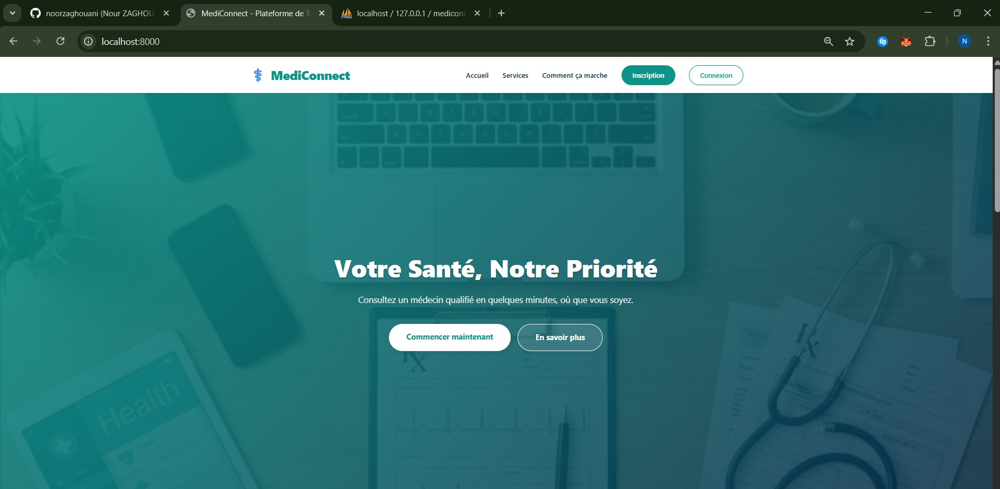
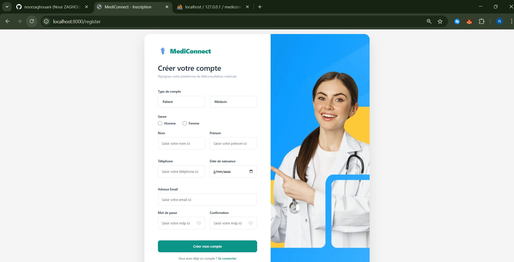
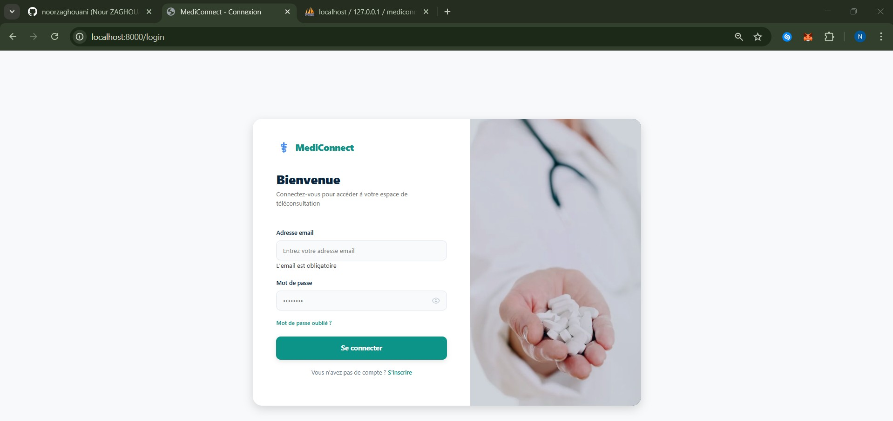

## 📋 Description
Mediconnect is a medical management web application allow patients to book appointments with verified doctors and manage their medical records.

## 🛠️ Technologies Used

- **Backend**: PHP 8.1+ with Symfony 6.4
- **Database**: MariaDB 10.4+ (ou MySQL 8.0)
- **ORM**: Doctrine 3.5
- **Templating**: Twig 3.0
- **Frontend**: HTML5, CSS3 (CSS variables), Vanilla JavaScript
- **Security**: Symfony Security Bundle (CSRF, auto-hashing)

## 📋 Prerequisites

Before starting, make sure you have installed:

- PHP >= 8.1 with the following extensions:
  - `ext-ctype`
  - `ext-iconv`
  - `pdo_mysql`
- Composer (PHP dependency manager)
- MariaDB >= 10.4 (ou MySQL >= 8.0)

## 📁 Project Structure
````
mediconnect/
├── bin/              # Symfony Scripts (console)
├── config/           # Configuration Symfony
│   ├── packages/     # Bundle configuration
│   └── routes/       # Route definitions
├── migrations/       # Database migrations
├── public/           # Public files (entry point)
│   ├── css/          # Stylesheets
│   ├── js/           # JavaScript scripts
│   ├── images/       # Static images
│   └── uploads/      # Uploaded files (certificates)
├── src/              # Application source code
│   ├── Command/      # CLI commands
│   ├── Controller/   # Controllers
│   ├── Entity/       # Doctrine Entities
│   ├── Form/         # Symfony Forms
│   ├── Repository/   # Doctrine Repositories
│   ├── Security/     # Authenticators
│   └── Service/      # Business Services
├── templates/        # Twig Templates
│   ├── admin/        # Administrator Templates
│   ├── doctor/       # Doctor Templates
│   ├── patient/      # Patient Templates
│   └── security/     # Login/Register
├── tests/            # Tests (PHPUnit)
├── var/              # Cache, logs (generated)
├── vendor/           # Composer dependencies (generated)
├── .env.example      # Configuration template
├── composer.json     # PHP dependencies
└── README.md         # This file
````

## 📷 Screenshots

### Application Homepage


### Register Page


### Login Page


*See more screenshots in the `images/` directory*

## 🚀 Installation

1. Clone the repository
````bash
git clone [https://github.com/noorzaghouani/MediConnect-.git]
cd mediconnect
````

2. Install dependencies
````bash
composer install
````

3. Configure the database
````bash
cp .env.example .env
# Edit .env with your database parameters
````

4. Create the database
````bash
php bin/console doctrine:database:create
php bin/console doctrine:migrations:migrate
````

5. Start the server
````bash
symfony serve
````

The application will be available at `http://localhost:8000`

## 👤 Author

- GitHub: [@noorzaghouani](https://github.com/noorzaghouani)

## 📝 License

This project is licensed under the MIT License.
````
``
